# Mid-term exam

> In Moodle, you have to change `$ $` into `\( \)` and 
> `$$ $$` into `\[ \]`. It is easier to enter in HTML format.
> Check Moodle XML if you want to convert this quiz into that format.
> Some parsing and adding several syntaxes are needed.

Sub-CPMK (Capaian Pembelajaran Mata Kuliah):  
Logika, Himpunan, Fungsi, dan Aljabar Boolean

## Q1
Misalkan $p$ adalah variabel proposisi untuk "Saat ini suhu ruangan dingin", 
dan  $q$ adalah variabel proposisi untuk "Saat ini hujan sedang turun".
Manakah kalimat yang benar untuk proposisi majemuk $q \vee \neg p$?

<ol type="A" style="text-indent:5px">
  <li> Saat ini hujan sedang turun atau suhu ruangan tidak dingin. 
  <li> Saat ini suhu ruangan dingin dan hujan sedang turun.
  <li> Saat ini suhu ruangan dingin dan hujan sedang turun. 
  <li> Saat ini hujan sedang turun dan suhu ruangan dingin. 
  <li> Saat ini hujan tidak turun atau suhu ruangan dingin.
</ol>

## Q2
Berapa kali nilai salah (_False_) muncul dalam proposisi
$\neg p \wedge q$ untuk segala kemungkinan nilai $p$ dan $q$?

<ol type="A" style="text-indent:5px">
  <li> 0
  <li> 4
  <li> 3
  <li> 2
  <li> 1
</ol>

## Q3
Berapa kali nilai benar (_True_) muncul dalam proposisi 
$p \vee \neg(p \wedge q)$ untuk segala kemungkinan nilai $p$ dan $q$?

<ol type="A" style="text-indent:5px">
  <li> 4
  <li> 3
  <li> 2
  <li> 1
  <li> 0
</ol>

## Q4
Nilai dua proposisi $\neg(p \wedge q)$ dan $\neg p \vee \neg q$ berturut-turut
saat $p$ bernilai salah (_False_) dan $q$ bernilai benar (_True_) adalah

<ol type="A" style="text-indent:5px">
  <li> (<i>True</i>, <i>True</i>)
  <li> (<i>False</i>, <i>False</i>)
  <li> (<i>True</i>, <i>False</i>)
  <li> (<i>False</i>, <i>True</i>)
  <li> Tidak dapat ditentukan
</ol>

## Q5
Bentuk sederhana dari proposisi $\neg(p \wedge q) \vee (\neg p \wedge q)$
adalah

<ol type="A" style="text-indent:5px">
  <li><!-- Empty line below to enable KaTeX--> 
  
  $\neg p$ 
  <li>

  $\neg q$
  <li>

  $p$
  <li>
  
  $q$
  <li>

  _False_
</ol>

## Q6
Bentuk lain dari implikasi $p \rightarrow q$ adalah

<ol type="A" style="text-indent:5px">
  <li> 
  
  $p \vee q$
  <li>
  
  $p \wedge \neg q$
  <li>
  
  $\neg p \wedge q$
  <li>

  $p \vee \neg q$
  <li> 
  
  $\neg p \vee q$
</ol>

## Q7
Proposisi "Jika produktivitas meningkat, maka gaji meningkat"
setara dengan proposisi

<ol type="A" style="text-indent:5px">
  <li> Produktivitas tidak meningkat atau gaji meningkat
  <li> Produktivitas meningkat atau gaji tidak meningkat
  <li> Produktivitas tidak meningkat dan gaji meningkat
  <li> Produktivitas meningkat dan gaji tidak meningkat
  <li> Produktivitas dan gaji meningkat
</ol>

## Q8
Negasi dari proposisi "Jika perempuan itu bekerja, maka dia akan 
memperoleh uang" adalah

<ol type="A" style="text-indent:5px">
  <li> Perempuan itu tidak bekerja atau dia akan memperoleh uang
  <li> Perempuan itu bekerja atau dia tidak akan memperoleh uang
  <li> Perempuan itu tidak bekerja dan dia akan memperoleh uang
  <li> Perempuan itu bekerja dan dia tidak akan memperoleh uang
  <li> Perempuan itu bekerja dan dia akan memperoleh uang
</ol>

## Q9
Himpuan manakah yang setara dengan himpunan $\{x, y, z\}$ 
(jawaban bisa lebih dari satu)

<ol type="A" style="text-indent:5px">
  <li> 

  $\{z, y, z, x\}$
  <li>

  $\{y, x, y, z\}$
  <li>

  $\{y, z, x, y\}$
  <li>

  $\{x, z, y, x\}$
  <li>

  $\{x, x, y, y\}$
</ol>

## Q10
Jika $\mathbb{N} = \{1, 2, 3, \ldots\}$, yaitu himpunan bilangan asli, 
maka himpunan yang sesuai dengan himpunan 
$B = \{x \in \mathbb{N} \mid 4 + x = 3\}$ adalah

<ol type="A" style="text-indent:5px">
  <li>

  $\{\{\,\}\}$
  <li>

  $\emptyset$
  <li>
  
  $\{-1\}$
  <li>
  
  $-1$
  <li> 

  $\{\}$
</ol>

## Q11
Diberikan himpunan semesta $U = \{1, 2, \ldots, 9\}$ dan misalkan
$$
  A = \{1, 2, 3, 4, 5\}, \quad
  B = \{4, 5, 6, 7\}, \quad
  C = \{5, 6, 7, 8, 9\}
$$
Maka himpunan $(A \cap B) \cap \overline{C}$ adalah

<ol type="A" style="text-indent:5px">
  <li>
  
  $\{\}$
  <li>
  
  $4$
  <li>

  $5$
  <li> 

  $\{4\}$
  <li>

  $\{5\}$
</ol>

## Q12
Himpunan $B - A$ setara dengan himpunan 

<ol type="A" style="text-indent:5px">
  <li>

  $B \cap \overline{A}$
  <li>

  $\overline{B} \cap A$
  <li>

  $B \cup \overline{A}$
  <li>

  $\overline{B} \cup A$
  <li>

  $\{\}$
</ol>

## Q13
Diagram Venn yang menggambarkan hukum De Morgan
$ \overline{(A \cap B)} = \overline{A} \cup \overline{B}$ adalah

<ol type="A" style="text-indent:5px">
  <li> 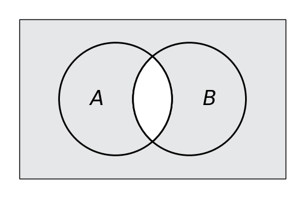 = 
      
  <li> 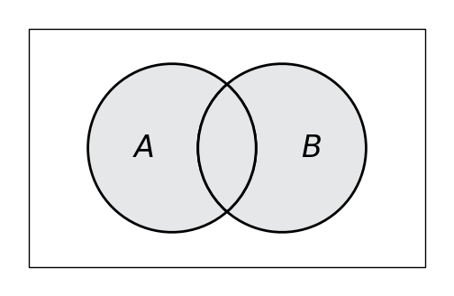 = 
      
  <li> 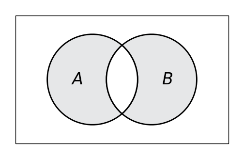 =
      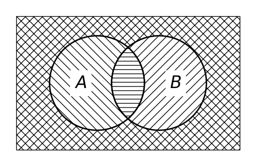
  <li> 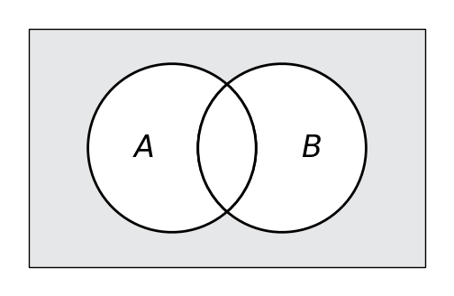 =
      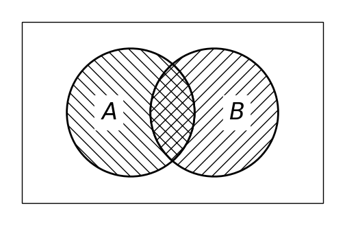
  <li>  =
      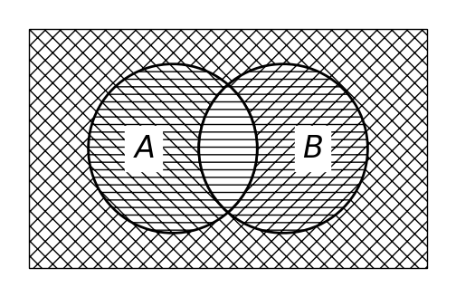
</ol>

## Q14 
Jika $U$ adalah himpunan semester, tentukan himpunan yang menyederhanakan 
$(A \cap U) \cap (\{\} \cup \overline{A})$
<ol type="A" style="text-indent:5px">
  <li>

  $\{\,\}$
  <li>

  $A$
  <li>

  $U$
  <li>

  $\overline{A}$
  <li>

  _True_
</ol>

## Q15
Setiap mahasiswa di jurusan Sistem Informasi diharuskan mengambil mata kuliah
Kalkulus 1 dan Matematika Diskrit. Pengumpulan data dari 140 mahasiswa menunjukkan 
bahwa:
- 60 orang telah lulus Kalkulus 1
- 40 orang telah lulus Matematika Diskrit
- 20 orang telah lulus kedua-duanya  

Berapakah jumlah mahasiswa yang belum lulus kedua mata kuliah tersebut? 
Petunjuk: Gunakan diagram Venn.

<ol type="A" style="text-indent:5px">
  <li> <del style="text-decoration-style: double">57</del>
    60
  <li> <del style="text-decoration-style: double">55</del> 
    50
  <li> <del style="text-decoration-style: double">53</del>
    45
  <li> <del style="text-decoration-style: double">44</del>
    40
  <li> 20
</ol>

## Q16
Diberikan himpunan tiga warna di dalam komputer sebagai berikut
$W = \{r, g, b\}$. Manakah yang merupakan _power set_ dari himpunan $W$?

<ol type="A" style="text-indent:5px">
  <li>
  
  $\{\{r, g\}, \{g, b\}, \{r, b\}, \{r\}, \{g\}, \{b\} \}$
  <li>
  
  $\{W, \{r, g\}, \{g, b\}, \{r, b\}, \{r\}, \{g\}, \{b\} \}$
  <li> 

  $\{W, \{r, g\}, \{g, b\}, \{r, b\}, \{r\}, \{g\}, \{b\}, \{\,\}\}$
  <li>

  $\{W, \{r\}, \{g\}, \{b\}, \{\,\}\}$
  <li>

  $\{W, \{r, g\}, \{g, b\}, \{r, b\}, \{\,\}\}$
</ol>

## Q17
Diberikan himpunan $X = \{1, 2, 3, 4\}$. Relasi manakah 
di bawah ini yang merupakan fungsi dari $X$ menuju $X$? 
(Jawaban bisa lebih dari satu)

<ol type="A" style="text-indent:5px">
  <li>

  $\{(1 \rightarrow 1), (2 \rightarrow 2), (4 \rightarrow 4)\}$
  <li>

  $\{(2 \rightarrow 3), (1 \rightarrow 4), (2 \rightarrow 1), (3 \rightarrow 2), (4 \rightarrow 4)\}$
  <li>
  
  $\{(3 \rightarrow 1), (4 \rightarrow 2), (1 \rightarrow 1)\}$
  <li>
  
  $\{(1 \rightarrow 4), (2 \rightarrow 1), (3 \rightarrow 2), (4 \rightarrow 3)\}$
  <li>

  $\{(2 \rightarrow 1), (3 \rightarrow 4), (1 \rightarrow 4),
    (2 \rightarrow 1), (4 \rightarrow 4)\}$
</ol>

## Q18
Fungsi lantai (_floor function_) didefinisikan sebagai
suatu fungsi yang mengubah input bilangan desimal $x$ ke pembulatan
ke bawah (bilangan bulat terbesar yang masih lebih kecil dari atau
sama dengan $x$).
Biasanya dituliskan $f(x) = \lfloor x \rfloor$.

Diberikan $g(x) = \lfloor x^2 / 3\rfloor $. Carilah nilai $g(S)$
saat $S = \{0, 1, 2, 3, 4, 5\}$

<ol type="A" style="text-indent:5px">
  <li>

  $\{0, 1, 2, 3, 6, 9\}$
  <li>

  $\{0, 1, 2, 3, 6, 8\}$
  <li>
  
  $\{0, 1, 2, 3, 5, 8\}$
  <li>

  $\{0, 0, 1, 3, 5, 8\}$
  <li>

  $\{0, 0, 1, 3, 3, 5\}$
</ol>

## Q19
Domain $\mathcal{D}$ dan range $\mathcal{R}$ berturut-turut untuk fungsi yang memetakan setiap 
bilangan bulat positif, sebut bilangan $a$, menuju suatu bilangan bulat
terbesar yang tidak melebihi akar kuadrat dari bilangan $a$.

<ol type="A" style="text-indent:5px">
  <li>
  
  $\mathcal{D} = \{0, 1, 2, \ldots\}$, 
  $\mathcal{R} = \{0, 1, 2, \ldots\}$
  <li>

  $\mathcal{D} = \{1, 2, 3, \ldots\}$, 
  $\mathcal{R} = \{0, 1, 2, \ldots\}$
  <li> 
  
  $\mathcal{D} = \{1, 2, 3, \ldots\}$, 
  $\mathcal{R} = \{1, 2, 3, \ldots\}$
  <li>
  
  $\mathcal{D} = \{1, 2, 3, \ldots\}$,
  $\mathcal{D} = \{0, 2, 4, \ldots\}$
  <li>

  $\mathcal{D} = \{0, 1, 2, \ldots\}$,
  $\mathcal{D} = \{1, 2, 3, \ldots\}$
</ol>

## Q20
Manakah fungsi injektif dari $\{a, b, c, d\}$ menuju dirinya sendiri
yang pemetaannya diberikan sebagai berikut? (Jawaban bisa lebih
dari satu)

<ol type="A" style="text-indent:5px">
  <li>

  $f(a) = b$, $f(b) = b$, $f(c) = d$, $f(d)= c$
  <li> 

  $f(a) = b$, $f(b) = a$, $f(c) = c$, $f(d) = d$
  <li>
  
  $f(a) = c$, $f(b) = a$, $f(c) = b$, $f(d) = d$
  <li>

  $f(a) = d$, $f(b) = b$, $f(c) = c$, $f(d) = d$
  <li>

  $f(a) = a$, $f(b) = b$, $f(c) = c$, $f(c) = c$
</ol>

## Q21
Manakah fungsi surjektif dari $\{a, b, c, d\}$ menuju dirinya sendiri
yang pemetaannya diberikan sebagai berikut? (Jawaban bisa lebih
dari satu)

<ol type="A" style="text-indent:5px">
  <li>

  $f(a) = b$, $f(b) = b$, $f(c) = d$, $f(d)= c$
  <li> 

  $f(a) = b$, $f(b) = a$, $f(c) = c$, $f(d) = d$
  <li>
  
  $f(a) = c$, $f(b) = a$, $f(c) = b$, $f(d) = d$
  <li>

  $f(a) = d$, $f(b) = b$, $f(c) = c$, $f(d) = d$
  <li>

  $f(a) = a$, $f(b) = b$, $f(c) = c$, $f(c) = c$
</ol>

## Q22

Manakah fungsi bijektif dari $\{a, b, c, d\}$ menuju dirinya sendiri
yang pemetaannya diberikan sebagai berikut? (Jawaban bisa lebih
dari satu)

<ol type="A" style="text-indent:5px">
  <li>

  $f(a) = b$, $f(b) = b$, $f(c) = d$, $f(d)= c$
  <li> 

  $f(a) = b$, $f(b) = a$, $f(c) = c$, $f(d) = d$
  <li>
  
  $f(a) = c$, $f(b) = a$, $f(c) = b$, $f(d) = d$
  <li>

  $f(a) = d$, $f(b) = b$, $f(c) = c$, $f(d) = d$
  <li>

  $f(a) = a$, $f(b) = b$, $f(c) = c$, $f(c) = c$
</ol>

## Q23
Ada berapa banyak _bytes_ yang diperlukan untuk melakukan _encoding_
$n$ _bits_ data dengan $n = 28\,800$. (Jawaban bisa lebih dari satu)

<ol type="A" style="text-indent:5px">
  <li>

  $5\,100\,\text{Bytes}$
  <li>
  
  $510\, \text{Bytes}$
  <li> 
  
  $5.1\, \text{kilo Bytes}$
  <li>
  
  $51\,\text{kilo Bytes}$
  <li>

  $51\,\text{Bytes}$
</ol>

## Q24
Diberikan fungsi $g$ yang memetakan himpunan $\{a, b, c\}$
ke himpunan $\{1, 2, 3, 4\}$ dengan aturan: $g(a) = 3$, $g(b) = 4$, 
$g(c) = 1$. Kemudian diberikan fungsi $f$ yang memetakan himpunan
$\{1, 2, 3, 4\}$ ke himpunan $\{a, b, c\}$ dengan aturan 
$f(2) = a$, $f(1) = b$, $f(3) = c$, $f(4) = a$.  

Penggambaran fungsi komposisi $f \circ g$ yang tepat adalah

<ol type="A" style="text-indent:5px">
  <li> 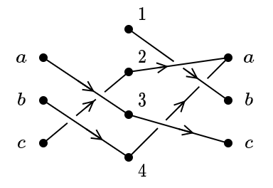
  <li> 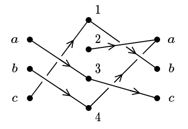
  <li> 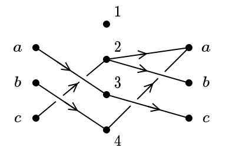
  <li> 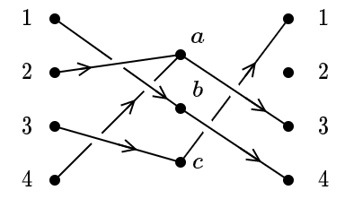
  <li> 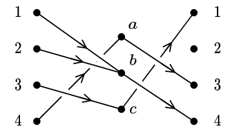
</ol>

## Q25
Bentuk _dual_ dari persamaan Boolean $a + \overline{a}b = a + b$ adalah

<ol type="A" style="text-indent:5px">
  <li>

  $\overline{a} + a\overline{b} = a + b$
  <li>

  $a(\overline{a} + b) = ab$
  <li>

  $a + \overline{a}b = a + b$
  <li>

  $\overline{a}(a + \overline{b}) = \overline{a}\overline{b}$
  <li>

  $a + b = a + \overline{a}b$
</ol>

## Q26
Bentuk sederhana dari ekspresi Boolan $xy\overline{z}yx$ adalah

<ol type="A" style="text-indent:5px">
  <li>
  
  $xyz$
  <li> 
  
  $xy\overline{z}$
  <li>

  $0$ 
  <li>
  
  $1$
  <li>

  $\overline{x}yz$
</ol>

## Q27
Berapa banyak nilai 1 dari fungsi Boolean 
$F(x, y, z) = x(yz + \overline{y}\,\overline{z})$ untuk semua kemungkinan
nilai $x$, $y$, dan $z$?
<ol type="A" style="text-indent:5px">
  <li> 2
  <li> 4
  <li> 6
  <li> 7
  <li> 8
</ol>

## Q28
Pasangan nilai $(x, y)$ yang memenuhi persamaan ekspresi Boolean
$xy = x+y$ adalah. (Jawaban bisa lebih dari satu)
<ol type="A" style="text-indent:5px">
  <li> 

  $(0, 0)$
  <li>

  $(0, 1)$
  <li>

  $(1, 0)$
  <li>

  $(1, 1)$
  <li>

  Tidak ada
</ol>

## Q29
Fungsi boolean $F(x, y, z) = xy + xz + yz$ bernilai 1, saat 
$(x, y, z)$ bernilai (jawaban bisa lebih dari satu)
<ol type="A" style="text-indent:5px">
  <li>

  $(0, 1, 1)$
  <li>

  $(1, 0, 0)$
  <li>
  
  $(1, 0, 1)$
  <li>
  
  $(1, 1, 0)$
  <li>
  
  $(1, 1, 1)$
</ol>

## Q30
Suatu fungsi Boolean dengan tiga variabel Boolean $(x, y, z)$ dapat dinyatakan sebagai kubus dengan titik sudut $xyz$ ditandai titik hitam
jika fungsi Boolean tersebut bernilai 1, selain itu tidak ada titik hitam. Berikut contoh untuk fungsi $F(x, y, z) = xy + \overline{z}$  
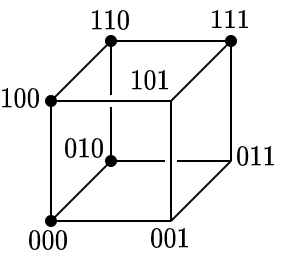

Untuk fungsi Boolean $F(x, y, z) = xy + xz + yz$, gambar
kubus yang sesuai adalah

<ol type="A" style="text-indent:5px">
  <li> 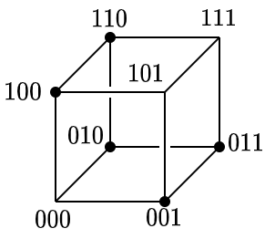
  <li> 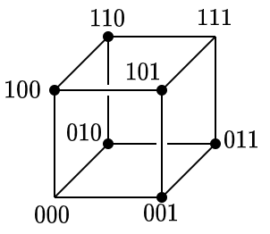
  <li> 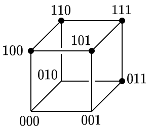
  <li> 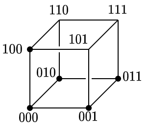
  <li> 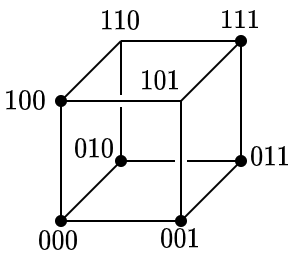
</ol>

## Q31
Fungsi Boolean $F(x, y, z) = \overline{x}\,\overline{y}z + \overline{x}y\overline{z} + \overline{x}yz + x\overline{y}z$ dapat disederhanakan 
menjadi fungsi Boolean
<ol type="A" style="text-indent:5px">
  <li>
  
  $F(x, y, z) = x\overline{y} + \overline{y}z$
  <li> 

  $F(x, y, z) = \overline{x}y + \overline{y}z$
  <li>

  $F(x, y, z) = \overline{x}y + y\overline{z}$
  <li>

  $F(x, y, z) = xy + xz$
  <li>

  $F(x, y, z) = x\overline{y} + y\overline{z}$
</ol>

## Q32
Bentuk jumlahan perkalian dari fungsi Boolean 
$F(x, y, z) = (x + z)y$ adalah (Petunjuk: gunakan tabel logika)
<ol type="A" style="text-indent:5px">
  <li>

  $\overline{x}yz + xy\overline{z} + xyz$
  <li>

  $x\overline{y}z + \overline{x}yz + xyz$ 
  <li>

  $xy\overline{z} + x\overline{y}z + xyz$
  <li>

  $\overline{x}y\overline{z} + \overline{x}\,\overline{y}z + xyz$ 
  <li>

  $\overline{x}y\overline{z} + x\overline{y}\,\overline{z} + xyz$
</ol>

## Q33
Suatu proposisi majemuk dikatakan **_satisfiable_** jika paling
sedikit ada satu pasangan nilai benar salah di dalam variabel 
proposisi yang membuat proposisi majemuk tersebut bernilai benar.
Contoh: proposisi majemuk $p \vee \neg q$ bernilai benar untuk pasangan
$(p, q) \in\{(\mathbf{F}, \mathbf{F}), (\mathbf{T}, \mathbf{F}), 
(\mathbf{T}, \mathbf{F})\},$ sehingga $p \vee \neg q$ bersifat
_satisfiable_, sedangkan proposisi majemuk $p \wedge \neg p$ selalu bernilai
salah apapun nilai $p$ sehingga $p \wedge \neg p$ tidak bersifat _satisfiable_.

Diberikan proposisi majemuk $((p \vee \neg q) \wedge (q \vee \neg r)) \wedge (r \vee \neg p)$. Tentukan apakah proposisi majemuk tersebut
_satisfiable_ atau tidak (jawaban bisa lebih dari satu)

<ol type="A" style="text-indent:5px">
  <li> 
  
  tidak _satisfiable_
  <li>
  
  _satisfiable_ dengan salah satu nilai $(p, q, r) = (\mathbf{F}, \mathbf{F}, \mathbf{F})$
  <li>
  
  _satisfiable_ dengan salah satu nilai $(p, q, r) = (\mathbf{T}, \mathbf{F}, \mathbf{F})$
  <li>
  
  _satisfiable_ dengan salah satu nilai $(p, q, r) = (\mathbf{F}, \mathbf{F}, \mathbf{T})$
  <li> 
  
  _satisfiable_ dengan salah satu nilai $(p, q, r) = (\mathbf{T}, \mathbf{T}, \mathbf{T})$
</ol>

## Q34
Jika diberikan variabel propisisi dengan kalimat proposisi:
- $m$: "Kamu boleh menonton film itu",
- $a$: "Kamu berusia di atas 18 tahun",
- $o$: "Kamu diizinkan oleh orang tua"  

maka kalimat "Kamu boleh menonton film hanya jika kamu berusia di atas 18 tahun
atau diizinkan oleh orang tua" dapat ditulis menggunakan variabel proposisi
(Jawaban bisa lebih dari satu)
<ol type="A" style="text-indent:5px">
  <li> 
  
  $(a \vee o) \wedge m$
  <li>
  
  $m \vee (a \vee o)$
  <li>

  $\neg(a \vee o) \rightarrow \neg m$
  <li>

  $m \rightarrow (\neg a \vee o)$
  <li>

  $m \rightarrow (a \vee o)$
</ol>

## Q35
Manakah pernyataan berikut yang benar? (Jawaban bisa lebih dari satu)
<ol type="A" style="text-indent:5px">
  <li> 

  $\{a, a\} \cup \{a, a, a\} = \{a, a, a, a, a\}$
  <li>

  $\{a, a\} \cup \{a, a, a\} = \{a\}$
  <li>

  $\{a, a\} \cap \{a, a, a\} = \{a, a\}$
  <li>

  $\{a, a\} \cap \{a, a, a\} = \{a\}$
  <li>

  $\{a, a, a\} - \{a, a\} = \{a\}$
</ol>

## Q36
Jarak antara dua himpunan $A$ dan $B$ dapat dihitung menggunakan 
**jarak Jacard**, $d_J(A, B)$
yang didefinisikan $d_J(A, B) = 1 - J(A, B)$ dengan
$J(A, B)$ adalah kemiripan Jacard yang didefinisikan sebagai 
$J(A, B) = |A\cap B|/|A \cup B|$. Jarak antara dua himpunan
$A = \{1, 2, 3, 4, 5, 6\}$ dan $B = \{2, 3, 4, 5\}$ adalah
<ol type="A" style="text-indent:5px">
  <li> 1/3
  <li> 2/3
  <li> 1
  <li> 0
  <li> tidak terdefinisi
</ol>

## Q37
Misalkan $f$ adalah fungsi dari $\{1, 2, 3, 4\}$ ke $\{a, b,c d\}$
dan $g$ adalah fungsi dari $\{a, b, c, d\}$ ke $\{1, 2, 3, 4\}$.
Kedua fungsi tersebut memiliki pemetaan sebagai berikut:
$f(1) = d$, $f(2) = c$, $f(3) = a$, $f(4) = b$, dan $g(a) = 2$,
$g(b) = 1$, $g(c) = 3$, dan $g(d) = 2$. Manakah pernyataa berikut yang benar?
(Jawaban bisa lebih dari satu)
<ol type="A" style="text-indent:5px">
  <li>

  $f$ memiliki invers karena fungsi $f$ adalah fungsi bijektif.
  <li>
  
  $g$ tidak memiliki invers karena fungsi $g$ adalah fungsi injektif.
  <li>
  
  $f$ dan $g$ keduanya tidak memiliki invers karena keduanya
  bukanlah fungsi injektif.
  <li>
  
  $f \circ g$ memiliki invers karena $f$ dan $g$ keduanya adalah fungsi
  bijektif.
  <li> 
  
  $g \circ f$ tidak memiliki invers karena $g$ bukan fungsi injektif.
</ol>

## Q38
Fungsi lantai (_ceiling function_) didefinisikan sebagai
suatu fungsi yang mengubah input bilangan desimal $x$ ke pembulatan
ke bawah (bilangan bulat terbesar yang masih lebih kecil dari atau 
sama dengan $x$).
Biasanya dituliskan $f(x) = \lfloor x \rfloor$.

Fungsi langit-langit (_ceiling function_) didefinisikan sebagai
suatu fungsi yang mengubah input bilangan desimal $x$ ke pembulatan
ke atas (bilangan bulat terkecil yang masih lebih besar dari atau 
sama dengan $x$).
Biasanya dituliskan $f(x) = \lceil x \rceil$.

Untuk nilai $n$ berapakah persamaan berikut berlaku?
$$
  n = \lceil n/2 \rceil + \lfloor n/2 \rfloor
$$
(Jawaban bisa lebih dari satu)
<ol type="A" style="text-indent:5px">
  <li> 
  
  $\{\ldots, -3, -2, -1, 0, 1, 2, 3, \ldots\}$
  <li>

  $\{\ldots, -5, -3, -1, 1, 3, 5,\ldots\}$
  <li>

  $\{0, 1, 2, 3, \ldots\}$
  <li>

  $\{\ldots, -3, -2, -1, 0\}$
  <li>

  Himpunan bilangan prima.
</ol>

## Q39   
Suatu fungsi Boolean $F$ dikatakan bersifat **_self dual_** jika dan
hanya jika $F(x_1, \ldots, x_n) 
  = \overline{F(\overline{x}_1, \ldots, \overline{x}_n)}$.
Manakah fungsi berikut yang bersifat _self dual_? (Jawaban bisa lebih
dari satu)
<ol type="A" style="text-indent:5px">
  <li>

  $F(x, y) = x$
  <li>

  $F(x, y) = xy + \overline{x}\,\overline{y}$
  <li>

  $F(x, y) = x + y$
  <li>

  $F(x, y) = xy + \overline{x}y$
  <li>

  $F(x, y) = x(x + y)$
</ol>

## Q40
Diberikan definisi suatu operator Boolean $\odot$ sebagai berikut:
$1 \odot 1 = 1$, $1 \odot 0 = 0$, $0 \odot 1 = 0$ dan $0 \odot 0 = 1$.

Apakah $(x \odot y) \odot z = x \odot (y \odot z)$ selalu benar 
untuk semua kemungkinan nilai $x$, $y$ dan $z$?
<ol type="A" style="text-indent:5px">
  <li> 
  
  Tidak, karena operator $\odot$  berbeda dengan
  operator logika $+$ dan $\cdot$.
  <li>

  Iya, karena ruas kanan dan kiri memiliki nilai
  yang sama untuk semua kemungkinan nilai $x$, $y$,
  dan $z$.
  <li>

  Iya, karena ada empat kali nilai 1
  untuk kedua ekspresi Boolean di ruas
  kanan dan kiri.
  <li>

  Iya, karena ada empat kali nilai 0 untuk kedua
  ekspresi Boolean di ruas kanan dan kiri.
  <li>

  Tidak, karena ruas kanan dan kiri memiliki nilai
  yang berbda untuk seua kemungkinan nilai $x$, $y$,
  dan $z$.
</ol>
