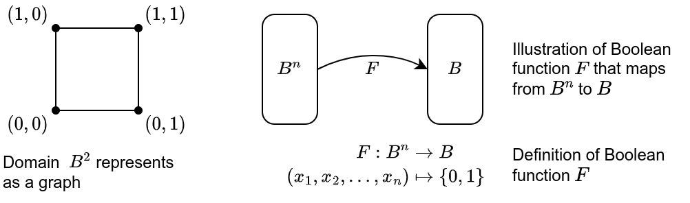
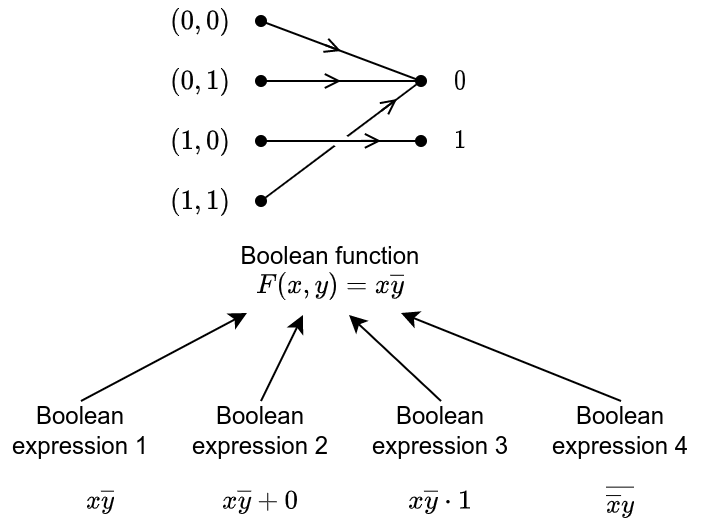
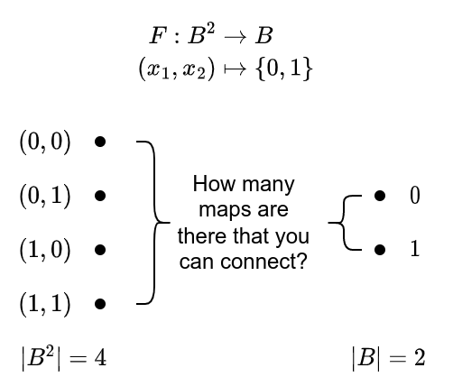
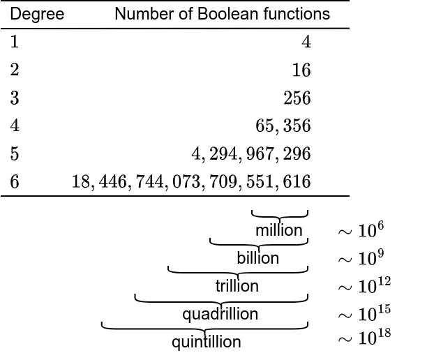

# Boolean algebra (part 01)

George Boole 1854 - The Laws of Thought

Claude Shannon 1938 showed how the basic rules of logic could be used
to design circuits

$$
\text{circuits} \rightarrow \text{Boolean function} 
  \rightarrow \text{efficient circuits}
$$

A map from Boolean function to efficient circuit can be done by several
algorithms such as Karnaugh maps and Quine-McCluskey method

To arrive the definition of Boolean algebra we have to build from basic concepts 
such as Boolean functions and Boolean variables.

## Boolean functions
### Introduction   
Boolean algebra consists of two "ingredients":
1. operations:
    - complementation ($\overline{0} = 1, \overline{1} = 0$)
    - Boolean sum ($+$, OR)
    - Boolean product ($\cdot$, AND)
2. variables: sets $\{0, 1\}$

Precendence of Boolean operations: (complement $\rightarrow$ Boolean products 
$\rightarrow$ Boolean sums)

Example:  
$$
  1 \cdot 0 + \overline{(0 + 1)} = 0 + \overline{1} = 0 + 0 + 0
$$

Comparison between propositional logic and boolean algebra
|   | operator | variables |
|---|----------|-----------|
|**Propositional logic** | $(\neg, \wedge, \vee)$               | $\{0, 1\}$ |
|**Boolean algebra**     | $(\overline{\phantom{x}}, \cdot, +)$ | $\{\text{True}, \text{False}\}$

### Boolean expressions and Boolean functions   
Before we discuss about we define the following definitions:

- A **Boolean variable** is a variable $x$ such that $x \in B$ where 
  $B = \{0, 1\}$.
- A **Boolean function** of degree $n$ is a function that maps from 
  $B^n$ to $B$.

  $$
    B^n = \{(x_1, x_2, \ldots, x_n) \mid x_i \in B \text{ for } 1 \leq i \leq n\}
  $$

  Example of the domain of Boolean function with degree 2: 
  $$
  \begin{align*}
    B^2 &= \{(x_1, x_2) \mid x_i \in B \text{ for } 1 \leq i \leq 2\} \\
        &= \{(0, 0), (0, 1), (1, 0), (1, 1)\}
  \end{align*}
  $$

  

  Example of a Boolan function of degree 2 :  
  $$
  \begin{align*}
    F(x_1, x_2): B^2 &\rightarrow B \\
      (x_1, x_2) &\mapsto \{0, 1\}
  \end{align*}
  $$
  where $F(x_1, x_2) = x_1 \overline{x}_2$

  | $x_1$ | $x_2$ | $\overline{x}_2$ | $F(x_1, x_2) = x_1 \overline{x_2}$ |
  |-------|-------|------------------|------------------------------------|
  | 1     | 1     | 0                | 0  |
  | 1     | 0     | 1                | 1  |
  | 0     | 1     | 0                | 0  |
  | 0     | 0     | 1                | 0  |

  Now we are ready to define the Boolean expression.  
  A **Boolea expression** in the variables $x_1, x_2, \ldots, x_n$
  are defined recursively:
  1. $0, 1, x_1, x_2, \ldots, x_n$ are Boolean expression.
  2. if $E_1$ and $E_2$ are Boolean expressions then $\overline{E}_1$, 
     $(E_1 E_2)$, and $(E_1 + E_2)$ are Boolean expression.

  Boolean functions $F$ and $G$ of $n$ variables are **equal** if and only 
  if $F(x_1, x_2, \ldots, x_n) = G(x_1, x_2, \ldots, x_n)$ whenever
  $(x_1, x_2, \ldots, x_n)$ belong to $B$.

  Two different Boolea expressions that represents the same function are calld 
  **equivalent**

  

  The **complement** of the Boolean function $F$ is the function $\overline{F}$,
  where $\overline{F}(x_1, x_2, \ldots, x_n) = \overline{F(x_1, x_2, \ldots, x_n)}$

  A **Boolean sum** of two boolean functions $F$ and $G$ is defined by
  $$
    (F + G)(x_1, x_2, \ldots, x_n) = F(x_1, x_2, \ldots, x_n) 
      + G(x_1, x_2, \ldots, x_n)
  $$

  A **Boolean product** of two boolean functions $F$ and $G$ is defined by
  $$
    (FG)(x_1, x_2, \ldots, x_n) = F(x_1, x_2, \ldots, x_n)
      G(x_1, x_2, \ldots, x_n)
  $$

  > How many Boolean functions are there?

  Let us explore for the Boolean function of order 2
  

  The following table shows all the possible function that we can construct
  from a Boolean function of order 2:
  | $x_1$ | $x_2$ | $F_0$ | $F_1$ | $F_2$ | $F_3$ | $F_4$ | $F_5$ | $F_6$ | $F_7$ | $F_8$ | $F_9$ | $F_{10}$ | $F_{11}$ | $F_{12}$ | $F_{13}$ | $F_{14}$ | $F_{15}$ |
  |---|---|---|---|---|---|---|---|---|---|---|---|---|---|---|---|---|---|
  | 0 | 0 | 0 | 1 | 0 | 1 | 0 | 1 | 0 | 1 | 0 | 1 | 0 | 1 | 0 | 1 | 0 | 1 |
  | 0 | 1 | 0 | 0 | 1 | 1 | 0 | 0 | 1 | 1 | 0 | 0 | 1 | 1 | 0 | 0 | 1 | 1 |
  | 1 | 0 | 0 | 0 | 0 | 0 | 1 | 1 | 1 | 1 | 0 | 0 | 0 | 0 | 1 | 1 | 1 | 1 |
  | 1 | 1 | 0 | 0 | 0 | 0 | 0 | 0 | 0 | 0 | 1 | 1 | 1 | 1 | 1 | 1 | 1 | 1 |

  $$
  \begin{align*}
    2^2 \left\{
    \begin{aligned}
      (0, 0) \rightarrow \text{2 possible output} \\
      (0, 1) \rightarrow \text{2 possible output} \\
      (1, 0) \rightarrow \text{2 possible output} \\
      (1, 1) \rightarrow \text{2 possible output}
    \end{aligned}
    \right.
  \end{align*}
  $$

  $$
    2^{2^2} = 2^4 = 16 \,\text{Boolean functions}
  $$

  
### Identities of Boolean algebra  
$$
\begin{align*}
  \text{Law of the double complement}
    &\quad \overline{\overline{x}} = x
      \\
  \text{Idempotent laws} \quad 
    &\left\{
    \begin{aligned}
      x + x = x \\
      x \cdot x = x 
    \end{aligned}
    \right. \\
  \text{Identity laws} \quad
    &\left\{
    \begin{aligned}
      x + 0 = x \\
      x \cdot 1 = x
    \end{aligned}
    \right. \\
  \text{Domination laws} \quad 
    &\left\{
    \begin{aligned}
      x + 1 = 1 \\
      x \cdot 0 = 0
    \end{aligned}
    \right. \\
  \text{Commutative laws} \quad
    &\left\{
    \begin{aligned}
      x + y = y + x \\
      x \cdot y = y \cdot x
    \end{aligned}
    \right. \\
  \text{Associative laws} \quad
    &\left\{
    \begin{aligned}
      x + (y + z) = (x + y) + z \\
      x(yz) = (xy)z
    \end{aligned}
    \right. \\
  \text{[show] Distributive laws} \quad
    &\left\{
    \begin{aligned}
      (x+y) (x+z) = x + yz \\
      x(y+z) = xy + xz
    \end{aligned}
    \right. \\
  \text{De Morgan's laws} \quad
    &\left\{
    \begin{aligned}
      \overline{(xy)} = \overline{x} + \overline{y} \\
      \overline{(x + y)} = \overline{x}\,\overline{y}
    \end{aligned}
    \right. \\
  \text{[show] Absorption laws} \quad
    &\left\{
    \begin{aligned}
      x + xy = x \\
      x(x+y) = x
    \end{aligned}
    \right. \\
  \text{Unit property} \quad
    & x + \overline{x} = 1 \\
  \text{Zero property} \quad
    & x \,\overline{x} = 0
\end{align*}
$$

### Duality  
The **dual** of a Boolean expression is obtained by interchanging Boolean
sum and Boolean product and interchanging $0$s and $1$s
$$
  + \rightleftarrows \cdot \\
  0 \rightleftarrows 1
$$

Example:  
Dual of $x(y + 0)$ is $x + (y \cdot 1)$  
Dual of $\overline{x} \cdot 1 + (\overline{y} + z)$ is 
  $(\overline{x} + 0) \cdot (\overline{y} \cdot z)$.  
Please remember that operator precedence follows the original expessions.

**Duality principle** is a principle that shows for an identity
between function represented by Boolean expressions remains valid when
the duals of both sides of the identity are taken.

Example:  
In absorption laws
$$
  x ( x + y) = x \quad \xleftrightarrow{\text{dual}}  \quad
  x + (x y) = x
$$

### The abstract definition of a Boolean Algebra  
A **Boolean algebra** is a set $B$ with two binary operations $\cdot$ and $+$, 
elements $0$ and $1$, and unary operator $\overline{\phantom{x}}$ (overline) 
such that these properties hold for all $x$, $y$, and $z$ in $B$:
$$
\begin{align*}
  &\left.
  \begin{aligned}
    x \cdot 0 = x \\
    x + 1 = x
  \end{aligned} \right\} \quad \text{identity laws} \\
  &\left. 
  \begin{aligned}
    x \cdot \overline{x} = 1 \\
    x + \overline{x} = 0
  \end{aligned}
  \right\} \quad \text{complement laws} \\
  &\left.  
  \begin{aligned}
    (x \cdot y) \cdot z &= x \cdot (y \cdot z) \\
    (x + y) + z &= (x + y) + z
  \end{aligned} 
  \right\} \quad \text{associative laws} \\
  &\left. 
  \begin{aligned}
    x \cdot y = y \cdot x \\
    x + y = y + x
  \end{aligned}
  \right\} \quad \text{commutative laws} \\
  &\left. 
  \begin{aligned}
    x \cdot (y + z) = (x \cdot y) + (x \cdot z) \\
    x + (y \cdot z) = (x + y) \cdot (x + z)
  \end{aligned}
  \right\} \quad \text{distributive laws}
\end{align*}
$$

## Representing Boolean Functions

### Motivation background
1. **First problem:**  
   Given the values of a Boolean function how can a Boolean    
   expression that represents this function be found?  

   **Answer:**  
   Every Boolean functon can be represented using the three Boolean operators:
   $\cdot$, $+$, and $\overline{\phantom{x}}$

2. **Second problem:**  
   Is there a smaller set of operators that can be used to represent 
   all Boolean functions?

   **Answer:**   
   All Boolean function scan be represented using only one operator

### Example of First Problem
We are given the value of a Boolean function. Turn them into Boolean expressions
| $x$   | $y$   | $x$   | $F$   | $G$   | |
|-------|-------|-------|-------|-------|-|
| 1     | 1     | 1     | 0     | 0     | |
| **1** | **1** | **0** | **0** | **1** | $\leftarrow$ |
| **1** | **0** | **1** | **1** | **0** | $\leftarrow$ |
| 1     | 0     | 0     | 0     | 0     | |
| 0     | 1     | 1     | 0     | 0     | |
| **0** | **1** | **0** | **0** | **1** | $\leftarrow$ |
| 0     | 0     | 1     | 0     | 0     | |
| 0     | 0     | 0     | 0     | 0     | |

[Note that we mark the rows that has value 1 for Boolean function $F$ and $G$]

An expression that has the value $1$ when  $x = z = 1$ and $y = 0$, and
the value 0 otherwise, is needed to represent $F$. Such an expression 
can be formed by taking the Boolean function
$$
  F(x, y, z) = x \overline{y} z
$$

To represent G, we need an expression that equals $1$ when
1. $x = y = 1$ and $z = 0$, or
2. $x = z = 0$ and $y = 1$

The Boolean product $xy\overline{z}$ has the value $1$ if and only if
$x = y = 1$ and $z = 0$. 
Similarly, the product $\overline{x}y\overline{z}$ has the value $1$ 
if and only if $x = z = 0$ and $y = 1$.

The Boolean sum of these two products $xy\overline{z} + \overline{x}y\overline{z}$, represents $G$, or 
$$
  G(x, y, z) = xy\overline{z} + \overline{x}y\overline{z}
$$
### Sum-of-product expansions  
- Definition of literal   
  A **literal** is a Boolean variable or its complement.   
  A **minterm** of the Boolean variables $x_1, x_2, \ldots, x_n$
  is a Boolean product $y_1 y_2 \cdots y_n$, where $y_i=x_i$ or 
  $y_i = \overline{x}_i$. Hence, a minterm is a product of $n$
  literals, with one literal for each variable.

  Example: Find a minterm that equals $1$ if $x_1 = x_3 = 0$
  and $x_2 = x_4 = x_5 = 1$, and equals $0$ otherwise.
  $$
    \overline{x}_1 \, x_2 \,\overline{x}_3 \,x_4 \,x_5
  $$

- The sum of minterms that represent a Boolen function is called the
  **sum-of-products expansion** or the **disjunctive normal form**.

  Example: Find the sum-of-products expansion for the function 
  $F(x, y, z) = (x + y) \overline{z}$
  $$
  \begin{align*}
    F(x, y, z) 
      &= (x + y) \overline{z} \\
      &= x\overline{z} + y\overline{z} \\
      &= x 1 \overline{z} + 1y\overline{z} \quad \text{(identity laws)}\\
      &= x(y + \overline{y}) \overline{z} + (x + \overline{x}) y \overline{z} 
        \quad \text{(unit property)}\\
      &= xy\overline{z} + x\overline{y}\overline{z} + xy\overline{z} 
          + \overline{x}y\overline{z} \\
      &= xy\overline{z} + x\overline{y}\overline{z}  
          + \overline{x}y\overline{z} 
  \end{align*}
  $$

$$
  \text{sum-of-product expansion} \xleftrightarrow{\text{dual}}
    \text{product-of-sum expansion} \\
  \text{(disjunctive normal form)} \xleftrightarrow{\text{dual}}
    \text{(conjunctive normal form)}
$$k

### Functional completeness 
The set of operators $\{+, \cdot, \overline{\phantom{x}}\}$ is
**functionally complete** if every Boolean function can be represented
using those operators

> Can we find a smaller set of functionally complete operators?

We can do so if one of the three operators of this set can be expressed
in terms of the other two. There are two ways to do that:

1. Eliminate Boolean sums $(x + y = \overline{\overline{x} \, \overline{y}})$
    $$
      (x + y) = \overline{\overline{(x + y)}} 
        = \overline{\overline{x} \, \overline{y}}
    $$
    $\Rightarrow$ The set of operators $\{\cdot, \overline{\phantom{x}}\}$ 
    is functionally complete

2. Eliminate Boolean products $xy = \overline{\overline{x} + \overline{y}}$
    $$
      xy = \overline{\overline{xy}} = \overline{\overline{x} + \overline{y}}
    $$
    $\Rightarrow$ The set of operators $\{+, \overline{\phantom{x}}\}$
    is functionally complete

> Can we find a smaller set of functionally complete operators, namely,
> a set containing just one operator?

There are two ways to do that: 
1. Define NAND operator (combination of NOT and AND operators), denoted
    by "$\mid$" (vertical bar) 
    | $x$ | $y$ | $x\mid y$ |
    |-----|-----|--------|
    | 1   | 1   | 0      |
    | 1   | 0   | 1      |
    | 0   | 1   | 1      |
    | 0   | 0   | 1      |

2. Define NOR operator, denoted by "$\downarrow$" (down arrow)
    | $x$ | $y$ | $x\downarrow y$ |
    |-----|-----|--------|
    | 1   | 1   | 0      |
    | 1   | 0   | 0      |
    | 0   | 1   | 0      |
    | 0   | 0   | 1      |

In the following procedure, we eliminate the other two operators
(product and complement) using NAND operator.
Elimination of Boolean products using NAND operator
$$
  xy = (x \mid y) \mid (x \mid y)
$$
Elminiation of complementary using NAND operator
$$
  \overline{x} = x\mid x
$$

Finally we have the following conversion for Boolean sums
$$
\begin{align*}
  x + y = \overline{\overline{x}\,\overline{y}}
    &= \overline{(x \mid x) (y \mid y)} \\
    &= \Big[ (x \mid x) (y \mid y) \Big] \,\Big|\,
        \Big[ (x \mid x) (y \mid y) \Big] \\
    &= \Bigg\{ 
        \Big[ (x \mid x) \mid (y \mid y) \Big] 
          \,\Big|\, \Big[ (x \mid x) \mid (y \mid y) \Big] \Bigg\}
        \,\Bigg|\,
        \Bigg\{ 
        \Big[ (x \mid x) \mid (y \mid y) \Big] 
          \,\Big|\, \Big[ (x \mid x) \mid (y \mid y) \Big] \Bigg\}
\end{align*}
$$
