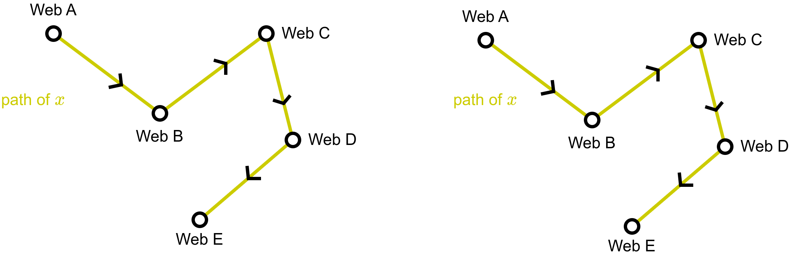
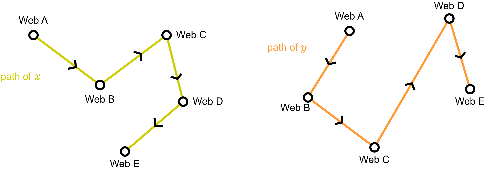
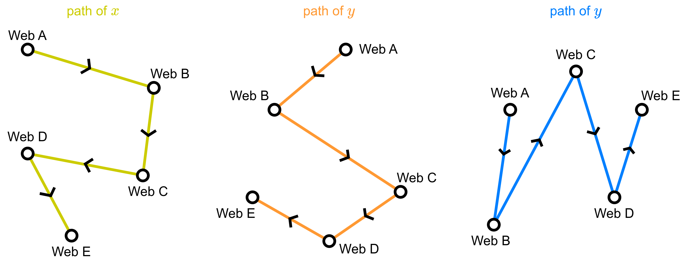
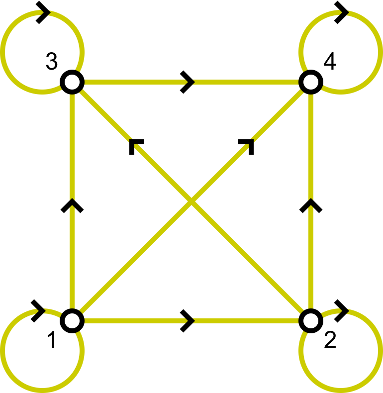
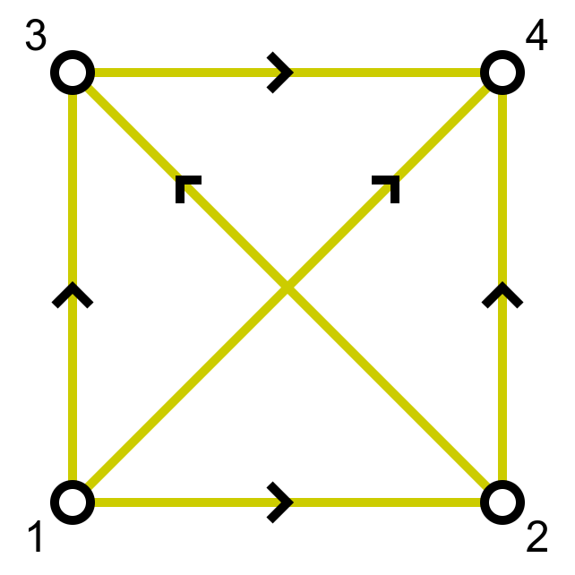
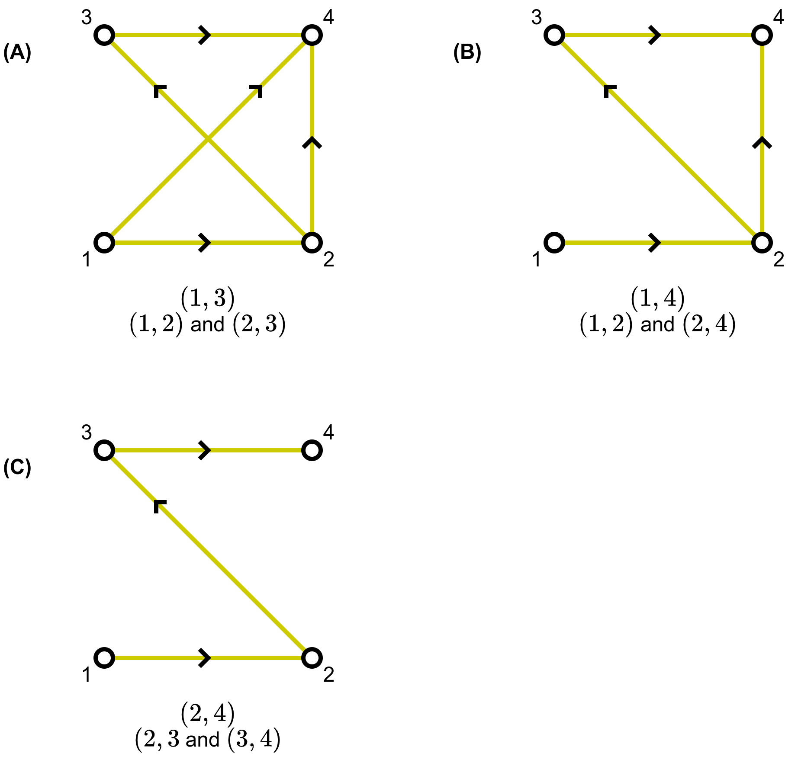
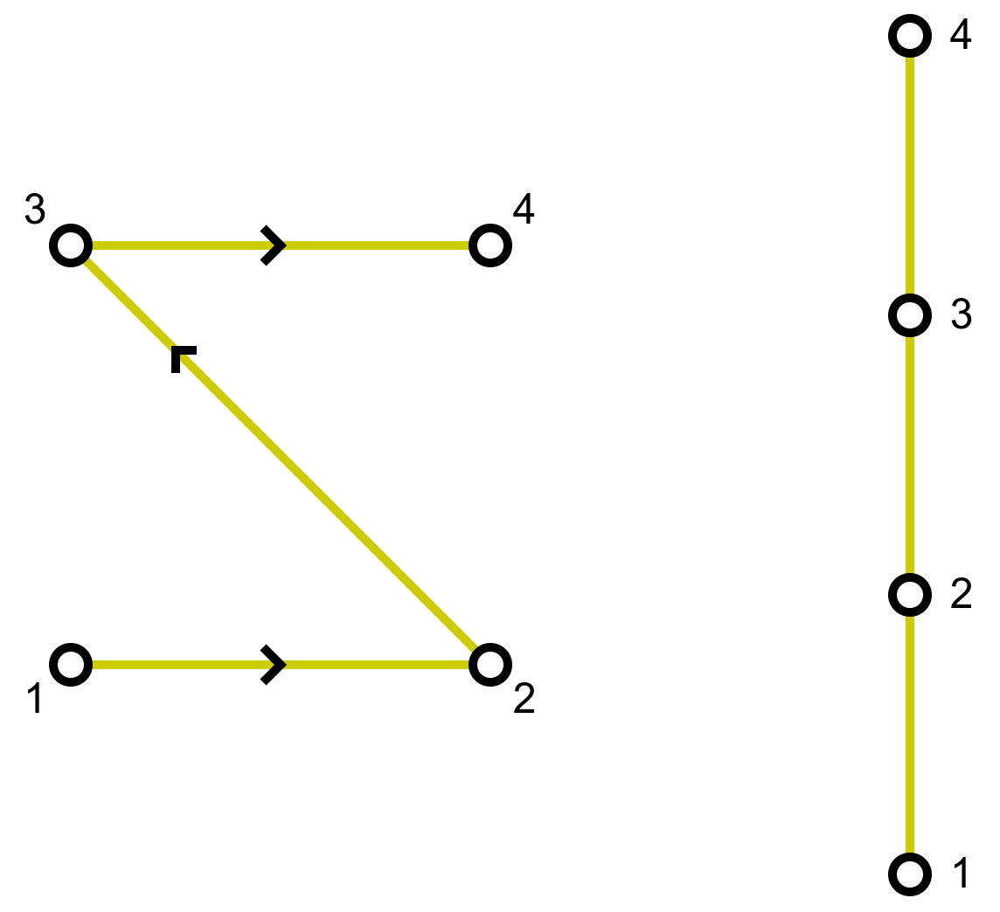

# Relations (part 02)

Objectives:
- Construction of Hasse diagram

## Review previous week

**Reflexive**

**Symmetric**

**Anti-symmetric**

**Transitive**

## Equivalence relation

A relation on a set $A$ is called an **equivalence relation** if it is    
reflexive, symmetric, and transitive.

Two elements $a$ and $b$ that are related by an equivalence relation are called  
**equivalent**.

The notation $a \sim b$ is often used to denote that $a$ and $b$ are   
equivalent elements with respect to a particular equivalence relation

**Example**: Let $R$ be the relation on the set of _all people who have 
visited a particular Web page_ such that  
$(x, y)$ if and only if person $x$ and person $y$ have followed the same  
set of links starting at this Web page (going from Web page to Web page  
until they stop using the Web)

$(x, x)$: $x$ has the same path of $x$ then $(x, x)$ is in $R$   
$\Rightarrow$ $R$ on $A$ is reflexive.

Given $(x, y)$ we can find $(y, x)$. This means that if I know two people  
$x$ and $y$ follow the same path then $y$ and $x$ also follow the same path  
$\Rightarrow$ $R$ on $A$ is symmetric

Given that $(x, y)$ and $(y, z)$, we have $(x, z)$ because $x$ and $y$  
are two equivalent path. Then $x$ and $z$ are two equivalent path  
$\Rightarrow$ $R$ on $A$ is transitive

## Partial ordering

A relation $R$ on a set $A$ is called a **partial ordering** (or partial  
order) if it is reflexive, antisymmetric, and transitive.  
A set $A$ together with a partial ordering $R$ is called a **partially 
ordered set** (or poset) and is denoted by $(A, R)$.  
Members of $A$ are called **elements** of the poset

**Example**: Greater than or equal to relation $( \geq )$ is a partial  
ordering on the set of integers
- Because $a \geq a$ for every integer $a$, $\geq$ is reflexive
- If $a \geq b$ and $b \geq a$ ,then $a = b$. Hence, $\geq$ is antisymmetric  
(There are no pairs $a \geq b$ and $b \geq c$)    
- $\geq $ is transitive because $a \geq b$ and $b \geq c$ imply that $a \geq c$.

It follows that $\geq$ is a partial ordering on the set of integers and 
$(\mathbb{Z}, \geq)$ is a poset.

**Example**: Let $R$ be the relation on the set of people such that $(x, y)$  
if $x$ and $y$ are people and $x$ is older than $y$.

- $R$ is antisymmetric because if a person $x$ is older than a person $y$,   
  then $y$ is not older than $x$. That is, if $(x, y) \in R$ then $(y, x) \notin R$   
- The relation $R$ is transitive because if person $x$ is older than person  
  $y$ and $y$ is older than person $z$, then $x$ is older than $z$.  
  That is if $(x, y) \in R$ and $(y, z) \in R$, then $(x, z) \in R$.  
- However, $R$ is not reflexive, because no person is older than himself or 
  herself. That is, $(x, x) \notin R$, for all people $x$.  

It follows that $R$ is **NOT** partial ordering

## Hasse Diagram

A down-to-top undirected graph to represent a partial ordering of relation  
$R$ on a set $A$  
**Example**: Consider the directed graph for the partial ordering 
$\{(a, b) \mid a \leq b\}$ on the set $\{1, 2, 3, 4\}$.  
We list all the pair $(a, b)$ such that $a \leq b$   

$$
\begin{align*}
  \begin{array}{cccc}
    (1, 1) & (2, 2) & (3, 3) & (4, 4) \\
    (1, 2) & (2, 3) & (3, 4) &        \\
    (1, 3) & (2, 4) &        &        \\
    (1, 4) &        &        &
  \end{array}
\end{align*}
$$

<table>
  <tr>
    <td>Draw the directed graph
    <td>
</table>

<table>
  <tr>
    <td>We do not have to show all the loops, because they must be presented
    <td>
</table>

Because a partial ordering is transitive, we do not have to show those edges.  
Remove all edges $(x, y)$ for which there is an element $z \in S$ such 
that $(x, z)$ and $(z, y)$

If we assume that all edges are pointed "upward", we do not have to show the directions of the edges

**Example**
