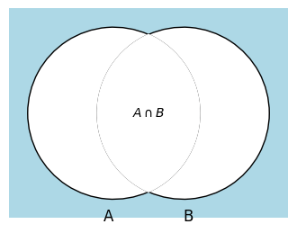

# Assignment 02

FullName1 (StudentID) 

Silahkan memilih dua problem berikut untuk diselesaikan.

## Problem 1 (30 poin)
Tentukan pernyataan berikut apakah bernilai benar atau salah, dan jelaskan 
mengapa bernilai benar atau bernilai salah
1. $\{\,\} \in \big\{ \{\,\} \big\}$   
2. $\big\{\{\,\}\big\} \in \big\{ \{\,\} \big\}$
3. $\big\{\{\,\}\big\} \subset \Big\{ \{\,\}, \big\{ \{\,\} \big\} \Big\}$
4. $\Big\{\big\{ \{\,\} \big\} \Big\} \subset 
    \Big\{\big\{\{\,\}\big\}, \big\{\{\,\}\big\}\Big\}$
5. $\{\,\} \in \Big\{\{\,\}, \big\{\{\,\}\big\}\Big\}$
6. $\big\{\{\,\}\big\} \in \Big\{\big\{\{\,\}\big\}\Big\}$
7. $\Big\{\big\{\{\,\}\big\}\Big\} \subset 
    \Big\{\{\,\}, \big\{\{\,\}\big\}\Big\}$

### Answer

## Problem 2 (30 poin)
Diberikan dua buah himpunan $A$ dan $B$, operasi **selisih simetrik**
yang dinotasikan $A \oplus B$ adalah himpunan yang memuat elemen-elemen
yang berada di $A$ atau di $B$ namun yang tidak berada bersamaan di 
$A$ dan $B$.
1. Carilah selisih simetrik dari dua himpunan berikut: $\{1, 3, 5\}$
   dan $\{1, 2, 3\}$
2. Carilah selisih simetrik dari himpunan mahasiswa SI yang mengambil 
   kelas Matematika diskrit dan himpunan mahasiswa SI yang mengambil 
   kelas Kalkulus 1
3. Gambarkan diagram Venn untuk operasi selisih simetrik dari dua 
   himpunan $A$ dan $B$.

### Answer

## Problem 3 (50 poin)
Prinsip inklusi-eksklusi dapat ditemukan juga untuk tiga buah himpunan.  
Jika diberikan tiga buah himpunan bagaimanakah bentuk (persamaan) prinsip
inklusi-eksklusi dari ketiga himpunan tersebut.  
Jelaskan bahwa prinsip inklusi-ekslusi tersebut benar menggunakan diagram 
Venn.

Apakah mungkin untuk menemukan prinsip inklusi-eksklusi untuk empat, lima, 
dan enam himpunan? Berikan alasan kemungkinan bisa atau tidaknya.

Petunjuk: Untuk menunjukkan prinsip inklusi-eksklusi benar di tiga himpunan
menggunakan diagram Venn, tunjukkan bahwa diagram Venn ruas kiri dan 
dan ruas kanan memiliki arsiran yang sama.
### Answer

## Problem 4 (50 poin)
Diberikan operator himpunan $?$ dan dua himpunan $A$ dan $B$ yang dikenai 
operator tersebut. Operator himpunan $?$ memiliki tabel keanggotaan sebagai
berikut 
| $A$ | $B$ | $A \operatorname{?} B$ |
|-----|-----|--------------|
| 1   | 1   | 0            |
| 1   | 0   | 1            |
| 0   | 1   | 1            |
| 0   | 0   | 0            |

Tunjukkan bahwa dua identitas berikut berlaku menggunakan diagram Venn
**dan** tabel keanggotaan
1. $A \operatorname{?} B = (A \cup B) \cap \overline{A \cap B}$
2. $A \operatorname{?} B = (A \cap \overline{B}) \cup (\overline{A} \cap B)$

### Answer

## Problem 5 (80 poin)
Carilah cara untuk menyatakan komplemen, _union_, 
dan _intersection_ dengan hanya menggunakan operator himpunan yang memiliki
wakilan diagram Venn sebagai berikut.

Kita sebut operator himpunan tersebut $\downarrow$.
Area yang diwarnai biru langit adalah himpunan 
$A \operatorname{\downarrow} B$

Petunjuk: Tentukan terlebih dahulu tabel keanggotaan untuk diagram Venn
di atas. Lalu dengan sedikit kreativitas dan imajinasi nyatakan 
operator himpunan komplemen, _union_, dan _intersection_ sebagai kombinasi
himpunan $A$ dan $B$ yang **hanya** memuat operator himpunan $\downarrow$

### Answer