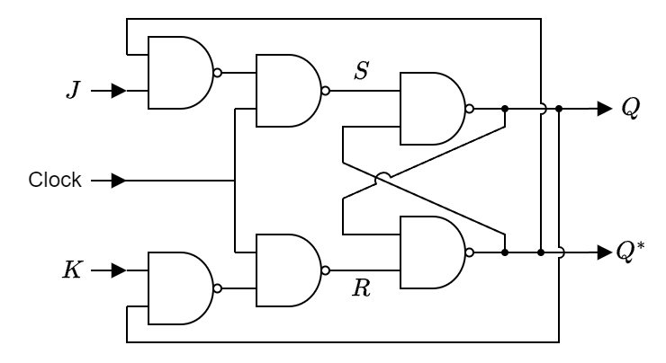

# Assignment 04

FullName (StudentID) 

Silahkan mengerjakan semua problem berikut. 

## Problem 1 (15 poin)
Sederhanakan ekspresi _sum-of-product_ berikut menggunakan ukuran K-maps yang 
sesuai 
1. $xyz + \overline{x}\,\overline{y}\,\overline{z} + x \overline{y}z + \overline{x}y\overline{z}$
2. $\overline{x}\,\overline{y}z + x\,\overline{y}\,\overline{z} + xyz + x\overline{y}z + \overline{x}\,\overline{y}\,\overline{z} + \overline{x}yz$
3. $w\overline{x}yz + wxy\overline{z} + \overline{w}\,\overline{x}yz + wx\overline{y}\,\overline{z} + \overline{w}\,xyz + wx\overline{y}z + \overline{w}\,\overline{x}\,\overline{y}\,\overline{z} + wxyz$

## Problem 2 (10 poin)
Untuk setiap _sum-of-product_ terdapat pasangan _product_of_sum_. Mungkinkah
kita menyusun K-maps untuk versi _product_of_sum_ ini? Berikan alasan jika mungkin
dan contoh K-maps untuk dua dan tiga variable Boolean jika ada. 

## Problem 3 (25 poin)

Nyatakan penjumlahan Boolean ($x + y$), perkalian Boolean ($x y$), dan 
komplemen variable Boolean ($\overline{x}$) ke dalam
operasi NOR (dilambangkan $\downarrow$) yang didefinisikan dengan tabel nilai Boolean sebagai berikut

| $x$ | $y$ | $x \downarrow y$ |
|-----|-----|------------------|
| 0   | 0   | 1                |
| 0   | 1   | 0                |
| 1   | 0   | 0                |
| 1   | 1   | 0                |

Hint: Pertama pahami definisi operasi NOR yaitu kaitannya dengan penjumlahan
Boolean, perkalian Boolean dan komplemen variable Boolean. Kemudian 
lakukan pengubahan dari definisi NOR tersebut.

## Problem 4 (50 poin)

Diberikan rangkaian sebagai berikut

Apakah perbedaan mendasar rangkaian di atas dengan rangkaian 
yang telah kita pelajari di kelas?

Lengkapi tabel nilai Boolean berikut

| Clock | $J$ | $K$ | $S$ | $R$ | $Q$ | $Q^*$ |
|-------|-----|-----|-----|-----|-----|-------|
| $\phantom{NULL}$ | | | | | | |
| $\vdots$         | | | | | | |
| $\phantom{NULL}$ | | | | | | |

Hint: Tentukan input dan output variable Boolean dan lakukan
pengisian tabel.