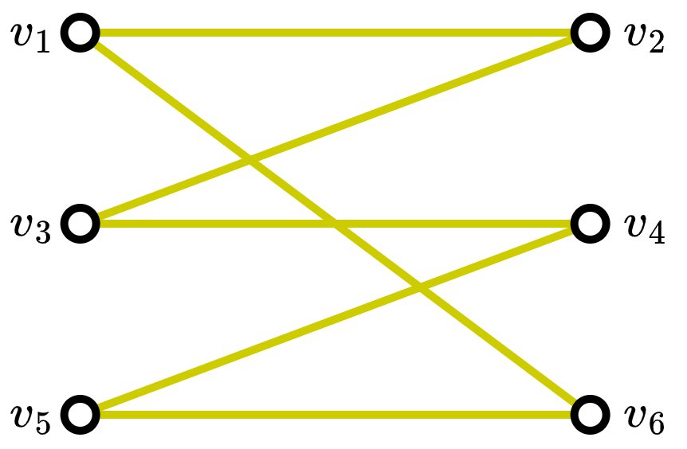
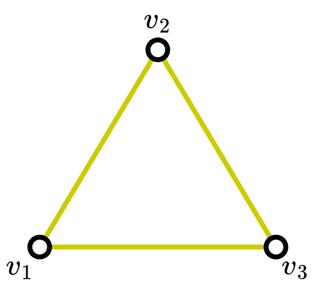
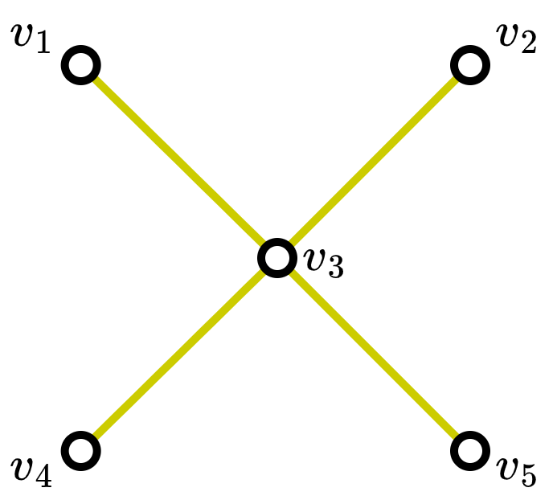
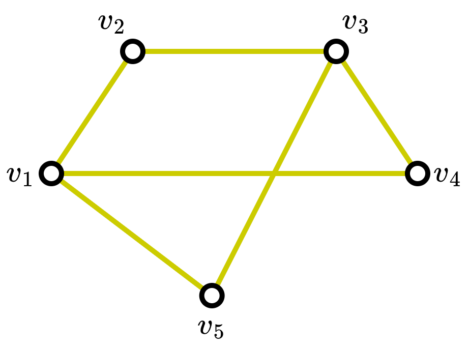
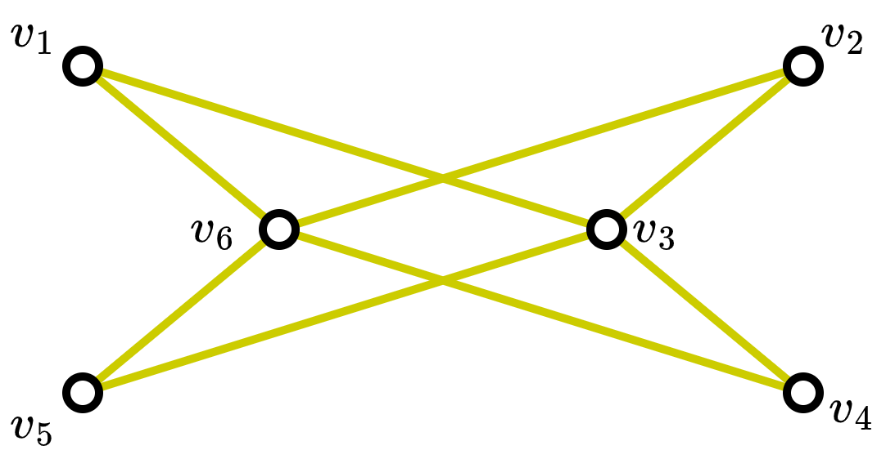
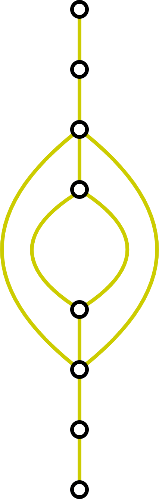
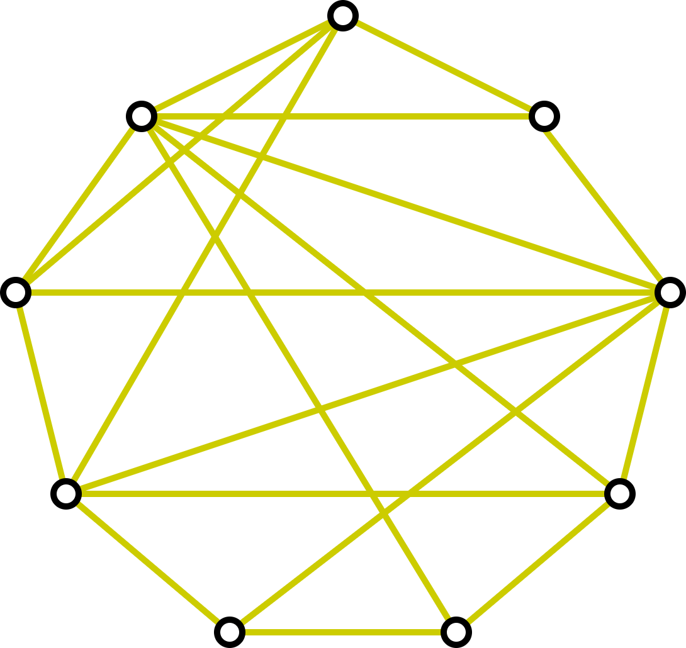

# Assignment 04

**Group members**
- FullName1 (StudentID) (Problem #)
- FullName2 (StudentID) (Problem #)
- FullName3 (StudentID) (Problem #)
- etc.

## Problem 1 (Combinatorial)
Dalam suatu acara makan bersama, terdapat 3 meja bundar yang dapat diisi
oleh 4 orang. Total tamu yang data sebanyak 15 orang. 
Ada berapa banyak cara menyusun lokasi tempat duduk tamu-tamu tersebut?

### Answer

## Problem 2 (Graph 1a)
Suatu graf dikatakan graf _bipartite_ jika kita dapat memisahkan 
himpunan simpul-simpulnya (_vertices_), $V$ menjadi dua himpunan simpul $V_1$ 
dan $V_2$ yang mana tidak ada busur (_edge_) sama sekali yang menghubungkan
dua simpul di dalam satu himpunan yang sama.

Sebagai contoh:
<table>
  <tr>
    <td><b>Graf</b></td>
    <td><b>Penjelasan</b></td>
  </tr>
  <tr>
    <td></td>
    <td> <b>Bipartite</b> karena kita dapat memisahkan simpul-simpulnya menjadi dua himpunan 
    <i>V</i>1 = {
      <i>v</i>1, 
      <i>v</i>3, 
      <i>v</i>5 } dan 
    <i>V</i>2 = {
      <i>v</i>2, 
      <i>v</i>4, 
      <i>v</i>6 } yang mana dimasing-masing himpunan 
    <i>V</i>1  dan <i>V</i>2 tidak ada busur penghubung dan setiap anggota <i>V</i>1 dan <i>V</i>2 memiliki setidaknya satu busur penghubung.</td>
  </tr>
  <tr>
    <td></td> 
    <td>Bukan bipartite, karena bagaimanapun kita memisahkan simpul-simpulnya, selalu ada penghubung antara simpul dalam satu himpunan yang sama. Misal kita buat <i>V</i>1 = { <i>v</i>1 } dan 
    <i>V</i>2 = { <i>v</i>2, <i>v</i>3 }. 
    Maka sangatlah jelas <i>v</i>2 dan <i>v</i>3 masih terhubung oleh busur dan tidak sesuai dengan definisi bipartite.</td>
  </tr>
</table>
Dari penjelasan di atas tentukan dan jelaskan apakah graf dibawah ini bipartite atau bukan:

1. 

2. 

3. 

### Answer

## Problem 3 (Graph 1b)
Tentukan dan jelaskan apakah mungkin melalui semua busur hanya sekali
di graf di bawah ini

### Answer

## Problem 4 (Graph coloring)

Lakukan pewarnaan pada setiap simpul graf di bawah ini sedemikian rupa
sehingga tidak ada dua simpul yang terhubung oleh suatu busur memiliki
warna yang sama. Himpunan warna yang dapat dipakai:
(Merah, Jingga, Kuning, Hijau, Biru, Ungu, dst.)

Ada berapa jumlah warna paling sedikit yang digunakan untuk mewarnai
graf diatas?

### Answer

## Problem 5 (Tree)

Berikut adalah papan dari _ultimate Tic-Tac-Toe_ berukuran 2x2.

Jika pemain pertama memulai dengan simbol X. Tentukan dan gambarkan 
diagram tree untuk 
kemungkinan dua langkah pertama dimulai dari papan kosong.
_Petunjuk_: Gunakan drawio untuk menggambar langkah papan lebih cepat.

### Answer

