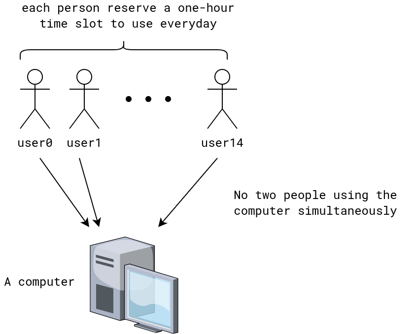

# Functions

## Motivation
- Problem 1  
  Data stored on a computer disk or transmitted over a data network 
  are usually represented as a s string of bytes. Each byte is made up
  of 8 bits. How many bytes are required to encode 100 bits of data?

- Problem 2     
  In asynchronous transfer mode (ATM) (a communication protocol
  used on backbone networks), data are organized into cells
  of 53 bytes. How many ATM cells can be transmitted in 1 minute
  over a connection that transmits data at the rate of 500 kilobits per 
  second?

- Problem 3    
  Given a schematic of a computer usage by 15 people:

  

  Example of the usage scenario:
  - `user0` takes 3 A.M. - 4 A.M.
  - `user1` takes 11 P.M. - 12 P.M.
  - . . .
  - `user14` takes 4:12 P.M - 5:12 P.M.

  Show that there is some continuous time span of 7 hours in which 5
  different people are using the computer.   
  **Hint**: Proof by contradicton and Pigeon Hole Principle.

## Introduction
- Definition of function     
  Let $A$ and $B$ be nonemtpy sets. A _function_ $f$ from $A$ to $B$
  is an assignment of exactly one element of $B$ to each element of $A$.
  We write $f(a) = b$ if $b$ is the unique element of $B$ assigned
  by the function $f$ to the element $a$ of $A$. If $f$
  is a function from $A$ to $B$, we write $f: A \rightarrow B$.

  - A figure that represents a functon

- Domain, codomain, image, pre-image, range,
  maps

- Examples: 
  - Assignments of grades to the students
  - Round-down function for a decimal

- Two function are **equal** when they have the same domain, have the same
  codomain, and map each element of their common domain to the same element in their common domain.

- Function addition
  
## One-to-one and onto functions
- injective function    
  A function $f$ is said to be _one-to-one_, or
  an _injection_, if and only 
  if $f(a_1) = f(a_2)$
  implies that $a_1 = a_2$ 
  for all $a_1$ and $a_2$ in
  the domain of $f$. A function is said to be 
  _injective_ if it is one-to-one.
  
- surjective function     
  A function $f$ from $A$ to $B$ is called 
  _onto_, or a _surjective_, if and only if
  for every element $b \in B$ there is an 
  element $a \in A$ with $f(a) = b$.
  A function $f$ is called _surjective_ if it is
  onto.
  
- bijective

## Inverse functions and compositions of functions
- Definition of inverse function
- Definition of composition of two functions $f$ and $g$

## The graphs of functions

Let $f$ be a function from the set $A$ to the set $B$. The _graph_ of
the function $f$ is the set of ordered pairs 
$\{(a, b) a \in A \text{ and } f(a) = b\}$.

## Some important functions
- Floor function
- Factorial functions
  
## (optional) Partial functions