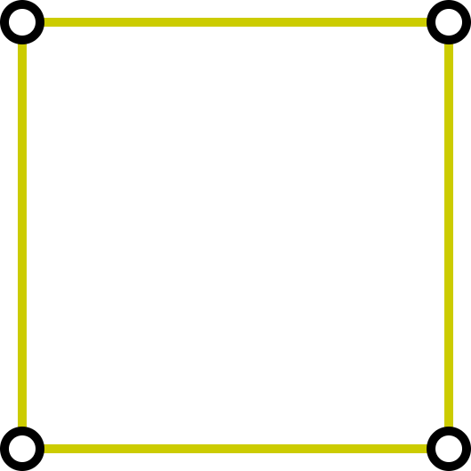
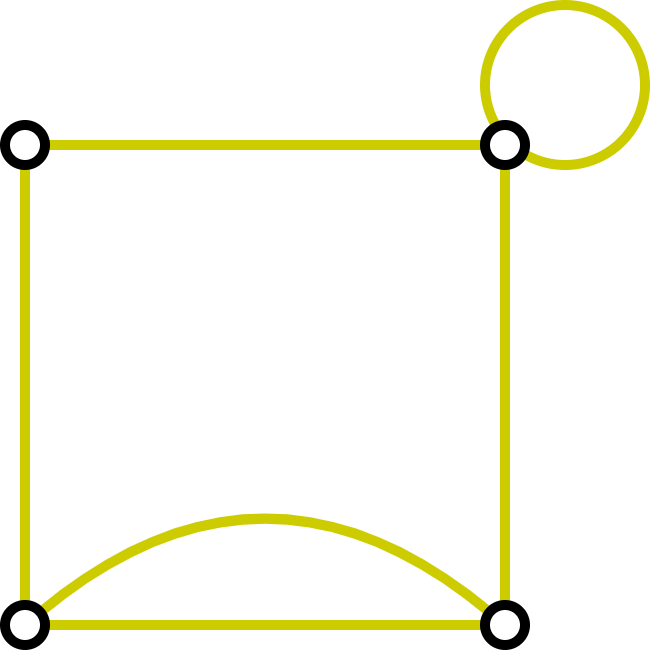
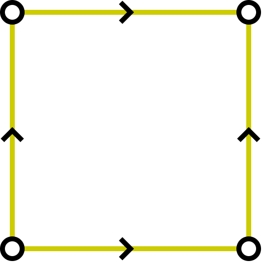
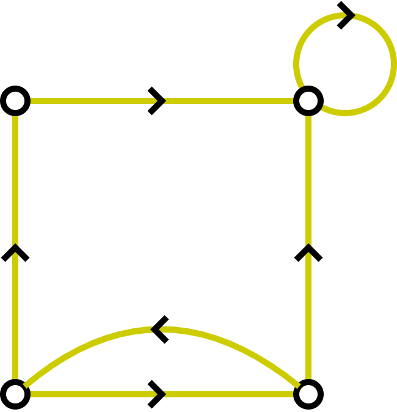

# Graphs (part 01)

Motivation: 
- The seven bridges of Königsberg
- Icosian puzzle
- [(Bakhshandeh et al., 2011) - Degrees of Separation in Social Networks](https://ojs.aaai.org/index.php/SOCS/article/view/18200/17991)
- [Indonesia submarine cable map](./figures/indonesia-submarine-cable-map.png)

## Graphs and graph models

**Definition 1**  
> A _graph_ $G = (V, E)$, consists of $V$, a nonempty set of _vertices_
> (or _nodes_) and $E$, a set of _edges_.  
> Each edge has either one or two vertices associated with it, called
> _endpoints_. An edge is said to _connect_ its endpoints.

**Example**

 

**Definition 2**  
> A _directed graph_ (or _digraph_) $(V, E)$ consists of a nonempty set
> of vertices $V$ and a set of _directed edges_ (or _arcs_) $E$.  
> Each directed edge is associated with an ordered pair of vertices.  
> The directed edge associated with the ordered pair $(u, v)$ is said  
> to _start_ at $u$ and _end_ at $v$.

**Example**

**TABLE 1** Graph terminology
<table>
  <tr>
    <td> <b>Type
    <td> <b>Edges
    <td> <b>Multiple Edges Allowed?
    <td> <b>Loops Allowed?
    <td> <b>Example
  <tr>
    <td> Simple graph
    <td> Undirected 
    <td> No
    <td> No
    <td> 
  <tr>
    <td> Multigraph
    <td> Undirected
    <td> Yes
    <td> No
    <td> 
  <tr>
    <td> Pseudograph
    <td> Undirected 
    <td> Yes
    <td> Yes
    <td> 
  <tr>
    <td> Simple directed graph
    <td> Directed
    <td> No
    <td> No
    <td> 
  <tr>
    <td> Directed multigraph
    <td> Directed
    <td> Yes
    <td> Yes
    <td> 
  <tr>
    <td> Mixed graph
    <td> Directed and undirected
    <td> Yes
    <td> Yes
    <td> 
</table>

## Graphs terminology and special types of graphs

### Basis terminology

**Definition 1**   
> Two vertices $u$ and $v$ in an undirected graph $G$ are called _adjacent_ 
> (or _neighbours_) in $G$ if $u$ and $v$ are endpoints of an edge $e$ of
> $G$. Such an edge $e$ is called _incident with_ the vertices $u$ and $v$ 
> and $v$, and $e$ said to _connect_ $u$ and $v$.

**Definition 2** (skipped)

**Definition 3**
> The _degree of a vertex in an undirected graph_ is the number of
> edges incident with it, except that a loop at a vertex contributes twice 
> to the degree of that vertex. The degree of the vertex $v$ is denoted
> by $\deg(v)$

**Definition 4** (skipped)

**Example** (For all definitions above)    

### Some special simple graphs (optional)

- Complete graphs
- Cycles
- Wheels
- $n$-cubes

## Connectivity

**Definition 1** (for undirected graph)
> Let $n$ be a nonnegative integer and $G$ an undirected graph.   
> A _path of length_ $n$ from $u$ to $v$ in $G$ is a sequence of $n$ 
> edges $e_1, \ldots, e_n$ of $G$ for which there exists a sequence
> $x_0 = u, x_1, x_2, \ldots, x_{n-1}, x_n = v$ of vertices such that 
> $e_i$ has, for $i = 1, \ldots, n$, the endpoints $x_{i-1}$ 
> and $x_i$.   
> When the graph is simple, we denote this path by its vertex sequence
> $x_0, x_1, \ldots, x_n$ (because listing these vertices uniquely
> determines the path).   
> The path is a _circuit_ if it begins and ends
> at the same vertex, that is, if $u = v$, and has length greater than 
> zero.    
> The path or circuit is said to _pass through_ the vertices
> $x_1, x_2, \ldots, x_{n-1}$ or _traverse_ the edges 
> $e_1, e_2, \ldots, e_n$.    
> A path or circuit is _simple_ if it does not contain the same
> edge more than once.

**Example 1**

**Definition 2** (for directed graph)   
> Let $n$ be a nonnegative integer and $G$ a directed graph.  
> A _path_ of length $n$ from $u$ to $v$ in $G$ is a sequence of edges
> $e_1, e_2, \ldots, e_n$ of $G$ such that $e_1$ is associated with
> $(x_0, x_1)$, $e_2$ is associated with $(x_1, x_2)$, and so on, with
> $e_n$ associated $(x_{n-1}, x_n)$, where $x_0 = u$ and $x_n = v$.  
> When there are no multiple edges in the directed graph, this path is  
> denoted by its vertex sequence $x_0, x_1, x_2, \ldots, x_n$.  
> A path of length greater than zero that begins and ends at the same
> vertex is called a _circuit_ or _cycle_.   
> A path or circuit is called _simple_ if it does not contain the same 
> edge more than once.

## Euler and Hamilton paths

**Definition 1** 
> An _Euler circuit_ in a graph $G$ is a simple circuit containing every  
> edge of $G$. An _Euler path_ in $G$ is a simple path containing
> every edge of $G$

**Example 1**

**Theorem 2**
> A connected  multigraph has an Euler path but not an Euler circuit if and 
> only if it has exactly two vertices of odd degree.

**Definition 2**   
> A simple path in a graph $G$ that passes through every vertex exactly  
> once is called a _Hamilton path_, and a simple circuit in a graph $G$  
> that passes through every vertex exactly once is called a
> _Hamilton circuit_. That is, the simple path $x_0, x_1, \ldots, x_{n-1}, x_n$  
> in the graph $G = (V, E)$ is a Hamilton path if $V = \{x_0, x_1, \ldots, x_{n-1}, x_n, x_0\}$ (with $n > 0$) is a Hamilton circuit if 
> $x_0, x_1, \ldots, x_{n-1}, x_n$ is a Hamilton path.

**Example 5**

## Past course activities (2023/Nov/01)
- Start by asking is it possible to solve "The seven bridges of Konigsberg
- If a student can give an answer to the problem state the answer and 
  show that we will have to formulate this into more rigorous formula (theorem)

- A student answered that it is not possible to solve "The seven bridges of 
  Konigsberg" when the number of "landmarks" is odd and the number of 
  bridges is even. [This is not a correct answer, but a good try]
- A student came up with the counterexample to the answer of first student.
  It is possible to have a path (we will show later that it is an Euler path)
  that will pass all the bridges (9 bridges, the student added 2 more bridges).

  

- Show Icosian puzzle (draw on the whiteboard)

- Start showing "Degrees of Separation in Social Networks"
- Start showing "Submarine cable map"

- Start the some graph definitions

Cantika Ade 10231024  (proof not strong enough)     
Muchlis  10231054  (counterexample)