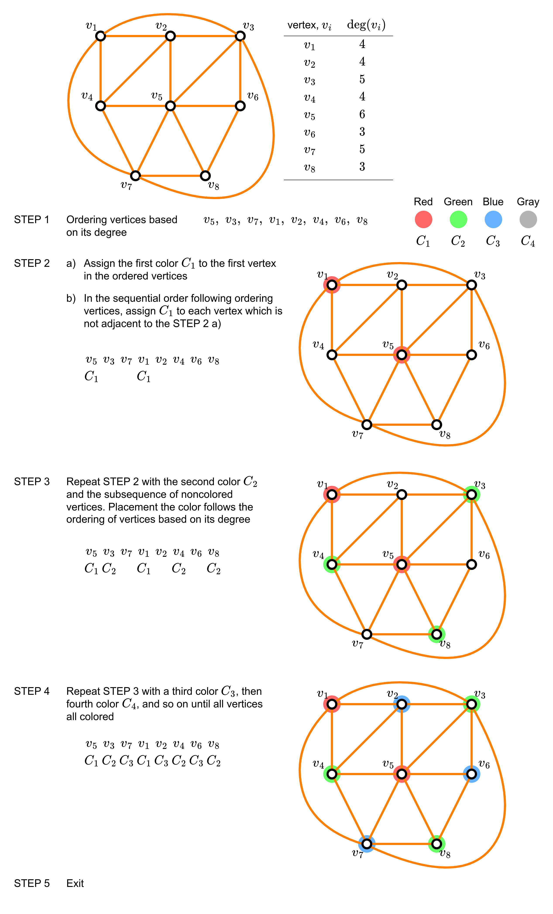

# Graphs (part 02)

Applications of graphs

## Graph coloring

In real world, graph coloring has a practical application
such as 
- index register: register allocation in compiler. 
See the complete lecture [CS143 - Compiler](https://web.stanford.edu/class/cs143/) from Stanford University.
- scheduling final exam
- frequency assignment

**Definition 1**: Graph  coloring  
> A _coloring_ of a simple graph is the assignment of a color to each 
> vertex of the graph so that no two adjacent vertices are assigned the 
> same color.

**Definition 2**: Chromatic number
> The _chromatic number_ of a graph is the least number of colors needed  
> for a coloring of this graph. The chromatic number of a graph $G$ is 
> denoted by $\chi(G)$.

## Welsh-Powell algorithm
(Lipschutz and Lipson, 2007)   
This is an algorithm to solve graph coloring problem.  

**Algorithm 8.4** (Welch-Powell): 
The input is a graph $G$.     
- STEP 1: Order the vertices of $G$ according to decreasing degrees.
- STEP 2: Assign the first color $C_1$ to the first vertex and then,
  in sequential order, assign $C_1$ to each vertex which is not adjacent
  to a previous vertex which was assigned $C_1$.
- STEP 3: Repeat STEP 2 with a second color $C_2$ and the subsequence of 
  noncolored vertices.
- STEP 4: Repeat STEP 3 with a third color $C_3$, then a fourth color 
  $C_4$, and so on until all verticecs are colored.
- STEP 5: Exit.

**Example** 

**Definition 1**: Planar graph   
> A graph is called _planar_ if it can be drawn in the plane
> without any edges crossing (where a crossing of edges is the
> intersection of the lines or arcs representing them at a point
> other than their common endpoint).    
> Such a drawing is called a _planar representation_ of the graph.

**Theorem 1**: The four color theorem   
> The chromatic number of a planar graph is no greater than four.  

The theorem above took 126 years to prove after the first conjencture is
formulated. The proof was done by the computer that took 100 hours.
